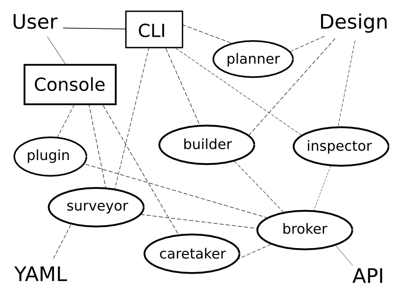

..  Titling
    ##++::==~~--''``

Implementation details
::::::::::::::::::::::

Architecture
============

The Architecture of Maloja tries to ensure:

    * Each distinct Use Case has a command to achieve it
    * Commands are invoked from the CLI, the Console or both
      as fits the Use Case
    * Each command is implemented in a separate module
    * Common operations against the API are the
      responsibility of a `Broker module`_

   Components of the Maloja toolkit

Common types
============

Maloja defines lightweight types for many things, including
API tokens:

    .. autoclass:: maloja.types.Token

Status messages:

    .. autoclass:: maloja.types.Status

As well as other message types which we'll see later on.
There's also a class to represent user plugins.

.. autoclass:: maloja.types.Plugin

Common utilities
================

A small number of functions are used frequently for parsing, sorting
and storing data.

.. autofunction:: maloja.workflow.utils.find_xpath

.. autofunction:: maloja.workflow.path.find_ypath

.. autofunction:: maloja.workflow.utils.group_by_type

Broker module
=============

.. autoclass:: maloja.broker.Broker
   :members:

.. autofunction:: maloja.broker.create_broker

Messages
~~~~~~~~

A broker object dispatches messages it finds in its `operations` queue.
Examples of these are:

    * :py:class:`maloja.types.Survey`
    * :py:class:`maloja.types.Design`
    * :py:class:`maloja.types.Stop`

.. autofunction:: maloja.broker.handler

Surveyor module
===============

The Surveyor is registered to run whenever a
:py:class:`maloja.types.Survey` message is received by the Broker.

.. autoclass:: maloja.surveyor.Surveyor
   :members:

Planner module
==============

.. automodule:: maloja.planner

You can test the module using one of the example files which come with
your Maloja installation.

On Ubuntu 14.04::

    $ ~/py3.4/bin/maloja @options.private plan --input=maloja/test/use_case01.yaml

On Windows 8.1::

    > %HOME%\py3.5\Scripts\maloja @options.private plan --input=maloja/test/use_case01.yaml

Builder module
==============

The Builder is registered to run whenever a
:py:class:`maloja.types.Design` message is received by the Broker.

.. autoclass:: maloja.broker.Builder
   :members: __init__, __call__, monitor
   :member-order: bysource

